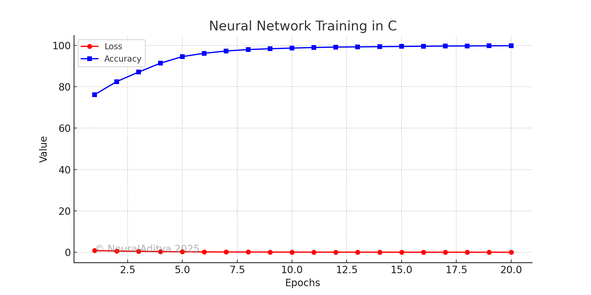

# Neural Network in C


## Overview



Neural\_Network\_C is an advanced neural network implementation in pure C, optimized for high performance on CPUs and NVIDIA GPUs. It includes features such as:

- **Dynamic network architecture** (user-defined layers and neurons)
- **GPU Optimization** (CUDA, cuBLAS, cuDNN, Tensor Cores support)
- **Advanced optimization techniques** (Adam, RMSprop, NAG, Dropout, BatchNorm, L2 Regularization)
- **Convolutional Layers & Attention Mechanisms** (CNNs, Self-Attention, Transformer Layers)
- **RNNs & LSTMs** (GRUs, Bi-Directional LSTMs)
- **Parallelization & Distributed Training** (OpenMP, multi-threading, CUDA Multi-GPU, MPI for clusters)
- **Federated Learning** (Decentralized model training across multiple clients)
- **Dataset loader & preprocessing** (MNIST, CIFAR-10, OpenCV for image augmentation, HDF5 support)
- **Compiler & CPU Optimizations** (AVX/SIMD, memory pooling, thread pools)
- **Mixed-Precision Training** (FP16 optimization for faster prformance)
- **Real-Time Monitoring** (TensorBoard alternative for tracking metrics)
- **Bayesian Hyperparameter Optimization** (Automated hyperparameter tuning)
- **Model Quantization** (Faster inference by reducing precision)

## Requirements

To run this project, you need:

### Dependencies:

- GCC or Clang (for CPU execution)
- NVIDIA CUDA Toolkit (for GPU acceleration)
- cuDNN (for optimized deep learning operations)
- OpenMP (for multi-threading support)
- MPI (for distributed training)
- OpenCV (for dataset preprocessing & augmentation)
- HDF5 (for dataset storage & retrieval)
- Python3 (for graph visualization with Matplotlib)
- TensorBoard Logger (for real-time metric tracking)

### Installation:

```sh
sudo apt update && sudo apt install -y build-essential cmake libopencv-dev hdf5-tools python3-pip
pip3 install matplotlib json-c tensorboard_logger
```

## Compilation

To compile the project, use:

```sh
make all
```

Or manually:

```sh
gcc -o neural_network main.c -lm -fopenmp -O3 -march=native -ljson-c -lhdf5 -I/usr/local/cuda/include -L/usr/local/cuda/lib64 -lcudart -lcublas -lcudnn
```

## Running the Project

To train the model:

```sh
./neural_network
```

To run on multiple GPUs:

```sh
mpirun -np 4 ./neural_network
```

## Features in Detail

### 1. **Federated Learning**

The model is trained across multiple clients, preserving data privacy by exchanging only gradients instead of raw data.

### 2. **Transformer Layers**

Implements multi-head self-attention and position-wise feed-forward networks for improved sequence learning.

### 3. **Dataset Augmentation**

Using OpenCV, images are augmented with flipping, rotation, and blurring to enhance generalization.

### 4. **Mixed-Precision Training**

FP16 computation speeds up training using Tensor Cores.

### 5. **Quantization**

Weights are quantized to reduce model size and increase inference speed.

### 6. **Bayesian Hyperparameter Optimization**

Automatically fine-tunes learning rates for optimal convergence.

## Output & Graph Visualization

After training, the results are saved in `training_plot.png`, displaying loss and accuracy progress.
To manually generate the graph:

```sh
python3 training_plot.py
```

## Contributing

1. Fork the repository
2. Create a new branch
3. Make improvements
4. Submit a pull request

## License

Distributed under the MIT License. See `LICENSE` for more information.

## Contact

Aditya Arora - adityaarora15898@gmail.com

Project Link: [https://github.com/NeuralAditya/Linear_Regression_C](https://github.com/NeuralAditya/Linear_Regression_C)

